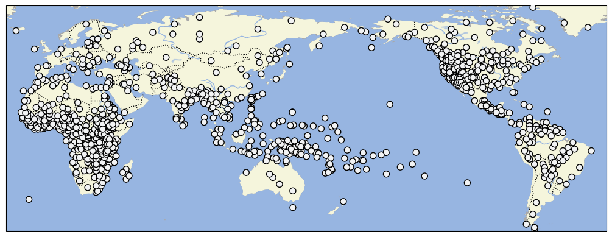

# D-PLACE dataset derived from Murdock et al. 1999 'Ethnographic Atlas'

## How to cite

If you use these data please cite
- the original source
  > Murdock, G. P., R. Textor, H. Barry, III, D. R. White, J. P. Gray, and W. T. Divale. 1999. Ethnographic Atlas. World Cultures 10:24-136 (codebook)
- the derived dataset using the DOI of the [particular released version](../../releases/) you were using

## Description

The Ethnographic Atlas (EA) describes cultural practices for 1291 societies, ranging from societies with complex agricultural economies and political systems to small hunter-gatherer groups. The societies are globally distributed with especially good coverage of Africa and western North America.

This dataset is licensed under a CC-BY-NC-4.0 license

## CLDF Datasets

The following CLDF datasets are available in [cldf](cldf):

- CLDF [StructureDataset](https://github.com/cldf/cldf/tree/master/modules/StructureDataset) at [cldf/StructureDataset-metadata.json](cldf/StructureDataset-metadata.json)